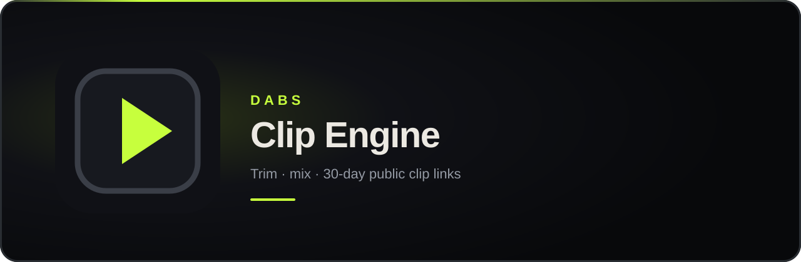

<p align="center">
  
</p>

<h1 align="center">Dabs Clip Engine</h1>

<p align="center">
  <strong>Trim the take. Mix the audio. Send a 30-day clip link.</strong>
</p>

<p align="center">
  A native Windows and Linux app for turning long recordings into tight, shareable clips — without giving the cloud your originals.
</p>

<p align="center">
  <a href="https://github.com/aaronfisher-code/clip-engine/releases/latest"></a>
  <a href="https://github.com/aaronfisher-code/clip-engine/releases/latest"></a>
  <a href="https://github.com/aaronfisher-code/clip-engine/releases/latest"></a>
</p>

<p align="center">
  <a href="https://github.com/aaronfisher-code/clip-engine/releases/latest"><strong>Download the latest build</strong></a>
</p>

---

## Get the app

Open the **[latest GitHub Release](https://github.com/aaronfisher-code/clip-engine/releases/latest)** and download the file for your computer. You do not need to install FFmpeg or other developer tools — those come with the app.

| If you use | Download this |
| --- | --- |
| **Windows** | The file ending in `_x64-setup.exe` |
| **Linux (easiest)** | The `.AppImage` — make it executable, then double-click it |
| **Debian / Ubuntu** | The `.deb` package |

After you install once, the app can update itself. On launch it checks GitHub for a newer release, and you can also choose **Check for updates** anytime.

Windows may show a SmartScreen warning the first time because the installer is not yet widely signed. Choose **More info**, then **Run anyway**. The Windows installer includes an optional **Create a clip in File Explorer** checkbox; uncheck it if you do not want a right-click item on videos. Linux AppImages need execute permission once (`chmod +x` on the file, or your file manager’s “Allow executing” option).

---

## What it is for

Clip Engine is for people who already record — games, streams, sessions — and want a fast path from a long file to a public link.

Work stays on your machine. You import recordings, play them at the original frame rate (including 120 fps), mark in/out points, pick which audio tracks to keep, and export a 1080p clip. Publishing uploads only that finished clip, not the source file. Recipients open a normal web page; they never need this app.

```text
Record  →  trim & mix locally  →  publish 1080p  →  send the link
```

---

## Features

**Cut on the original file.** Preview uses the recording you already have. Seeking is frame-accurate, hardware decode is used when the GPU allows it, and video is not re-encoded just to watch it.

**Mix audio without cooking the picture.** Enable one track or several. The mix happens in the player; video stays untouched until you export.

**GPU encode when you have it.** NVIDIA NVENC, Intel Quick Sync, and AMD AMF are detected at runtime, with a CPU fallback if needed. Output is 1080p, up to 120 fps.

**Right-click to clip (Windows).** The installer can add a **Create a clip** item to File Explorer. It is a checkbox during setup, so you can leave it off. Choosing it opens that video in Clip Engine.

**OBS-aware import.** Grab files with the system picker, or drop them from an inbox under your Videos folder.

**Built-in replay recorder.** Open **Recorder** to select a display, route
system/application/microphone audio to separate MKV tracks, choose a reported
frame rate (including 120–240 fps when the capture path supports it), set the
replay length, and bind a global save hotkey. The libobs helper is a separate
process and is started lazily, so the editor does not carry OBS's runtime during
ordinary library work.

Recording memory is measured on the helper rather than capped artificially:
encoded replay storage is approximately `bitrate × replay seconds ÷ 8`, plus
OBS and capture overhead. Hardware encoding and shorter buffers keep 1080p120
and 1440p120 efficient; longer, higher-quality, or software-encoded buffers
naturally use more memory.

**A library that stays yours.** Clips live in a local library on your PC. Approved teammates also see a shared cloud library of what the group has published.

**Links that expire.** Published clips get a public page with a preview image, then disappear after 30 days. You can extend a clip or revoke access when you need to.

---

## Sharing a clip

Anyone with the link can watch. The page looks like a finished product — title, duration, quality, who uploaded it — and works in Discord, browsers, and anywhere Open Graph previews show up.

- Each published clip gets its own public page — no account needed to watch
- Links last **30 days** from publish (or from the last time you extend them)
- Deleting a published version removes the online video and thumbnail
- Your original recording is never deleted by Clip Engine

---

## Accounts, without the usual hassle

Publishing is for people the owner has approved. Watching a shared link does not require an account.

1. Install the app and choose **Create account**.
2. Pick a username, a display name, and a password. No email is collected.
3. Request access and wait — the owner reviews the queue under **Manage access**.
4. Once approved, sign in. You stay signed in across restarts until you sign out or the owner revokes you.

Forgot a password? The owner can issue a one-day reset from **Manage access → Active**. You never have to send a human password over the internet: the app derives a credential on your device, and the server only ever sees that.

---

## What stays on your computer

| | |
| --- | --- |
| Original recordings | Left where you saved them. Clip Engine does not delete them. |
| Local library | Windows: `%LOCALAPPDATA%\dev.dab.clip-engine`<br>Linux: `~/.local/share/dev.dab.clip-engine` |
| Sign-in | Stored in Windows Credential Manager or the Linux keyring — not in a random file on disk |
| Cloud upload | Only the published 1080p clip and its thumbnail, with short-lived credentials scoped to those two files |

---

## For developers and operators

Building from source, deploying the Cloudflare Worker, or shipping installers is documented separately so this page can stay about using the product.

- **[Setup guide](docs/SETUP.md)** — local development, production cloud, owner onboarding, and release publishing
- **[Security model](docs/SECURITY.md)** — trust boundaries, credentials, and revocation

The desktop is a native Rust app. Official installers are built in CI and attached to GitHub Releases; that is also how in-app updates are delivered.
